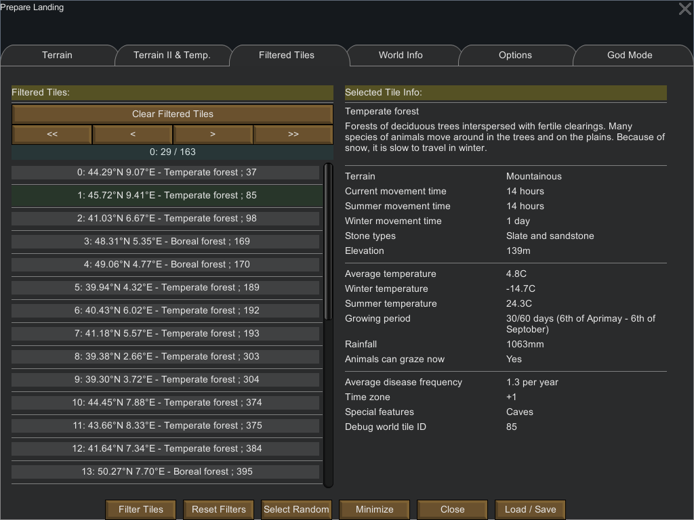

Filtered Tiles Tab
==================

The filtered tiles tab shows the tiles that were filtered when you chose a filter and pressed the `Filter` button at the bottom of the main window.

# Left Part

The left part of the window gives the filter tiles while the right part gives some information about the currently selected tile.

The left part is organized as follows:

- Button header
- List of tiles

The button header is similar to the one from the [Minimized Window](starting.md#minimized-window).

* The top button clear all filtered tiles
* 4 buttons used to navigate inside the list of filtered tiles:
    - `<<`: Go to the start of the list
    - `<`: Go to the previous page (if any)
    - `>`: Go to the next page (if any)
    - `>>`: Go to the end of the list

Finally, the label indicator (in the above screenshot it indicates `0: 29 / 31`) which can be read as follows:

* `X: Y / Z`
    - `Z`: the list of filtered tiles has `Z` entries (e.g. 31 in the above screenshot)
    - `X : Y `: You are seeing the entries from `X` to `Y` (e.g. 0 to 29 in the screenshot)

# Tile Entries

Each entry in the filtered tile list is composed as follows:

- index: Latitude Longitude - Biome; tile ID

# Right Part

Clicking on an entry in the list of filtered tiles in the right part of the window displays information about the selected tile.