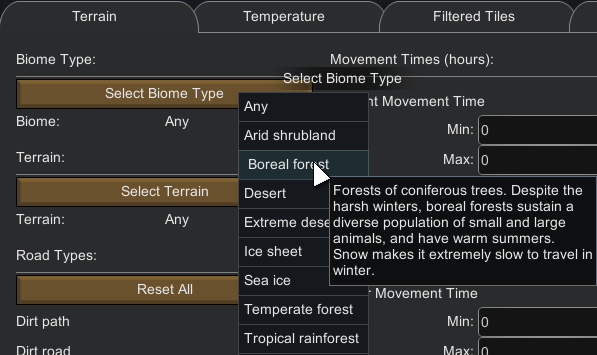
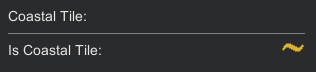
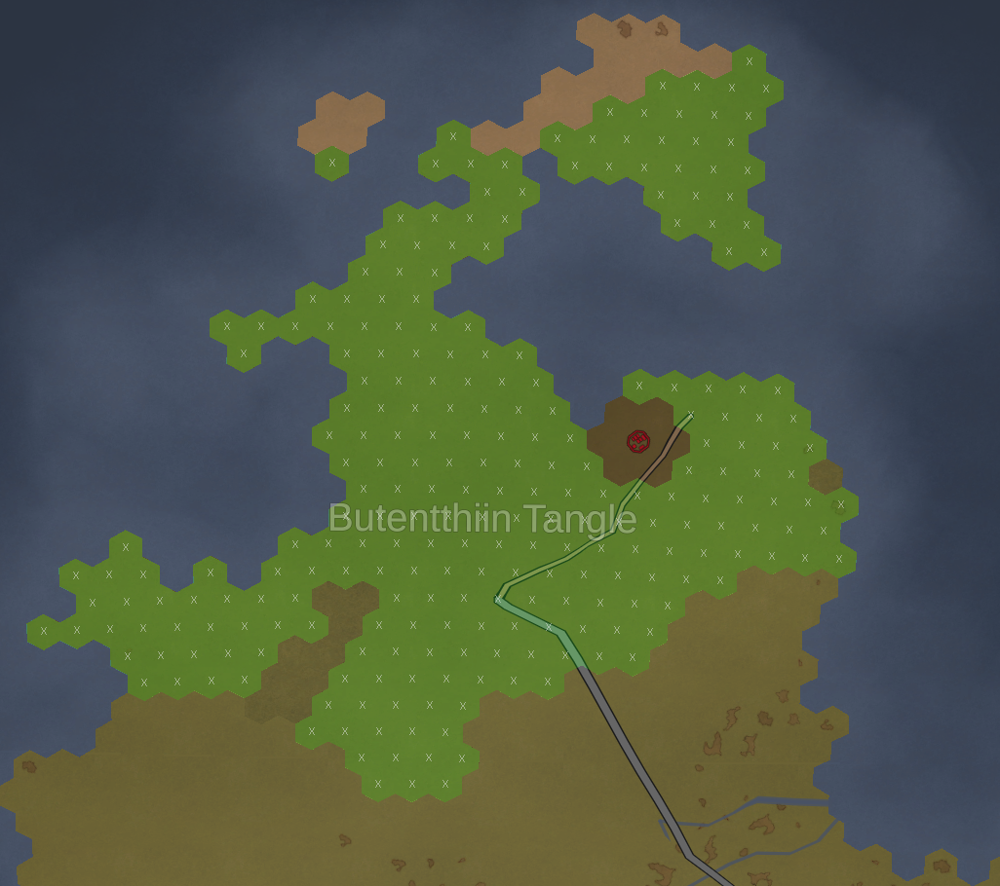
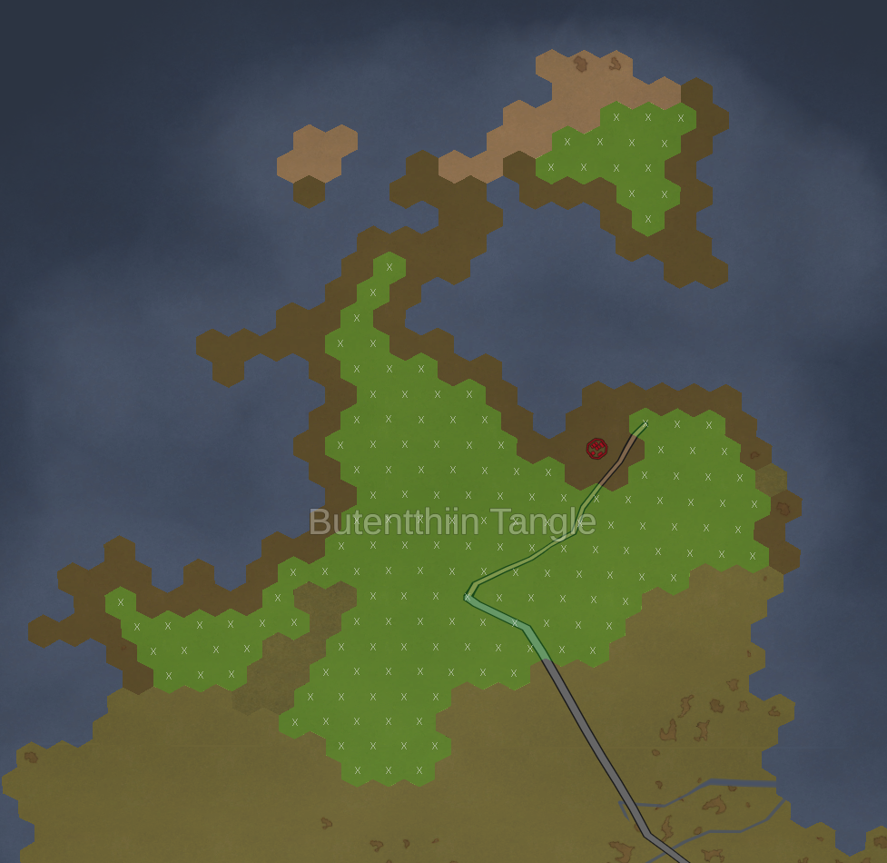
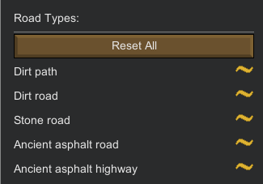
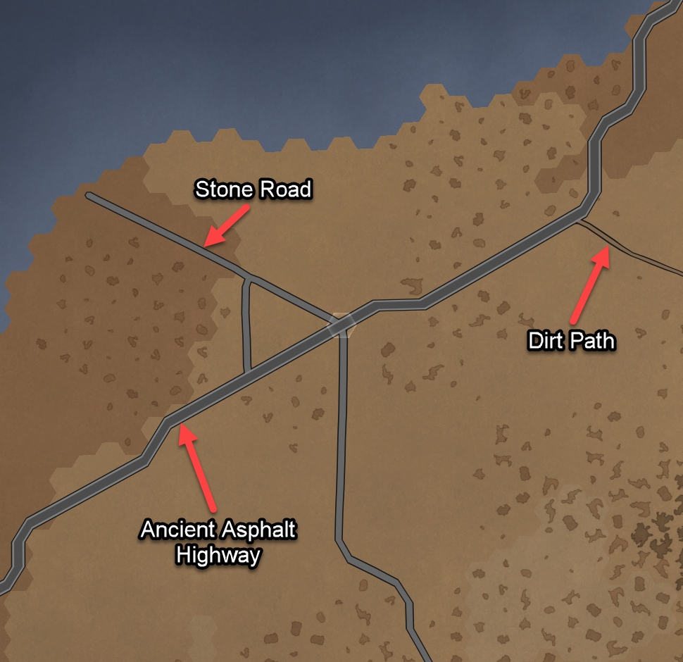
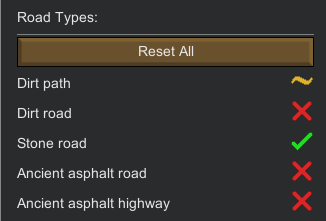
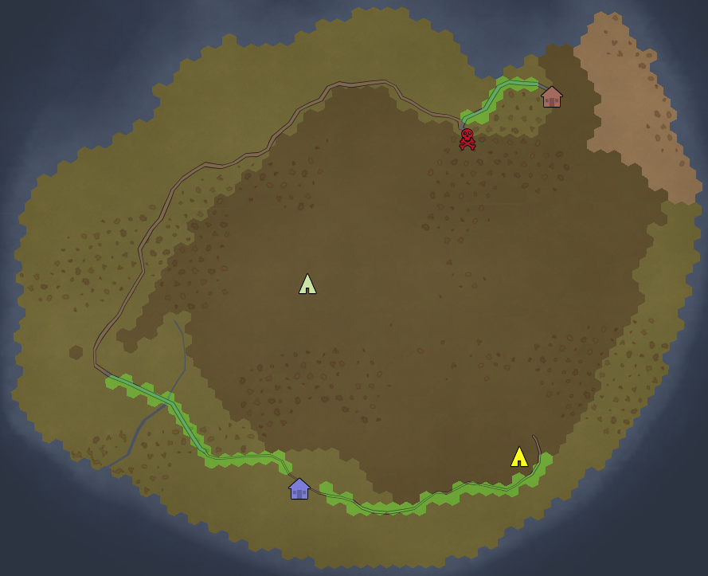
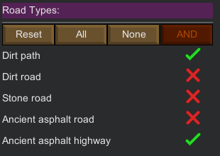
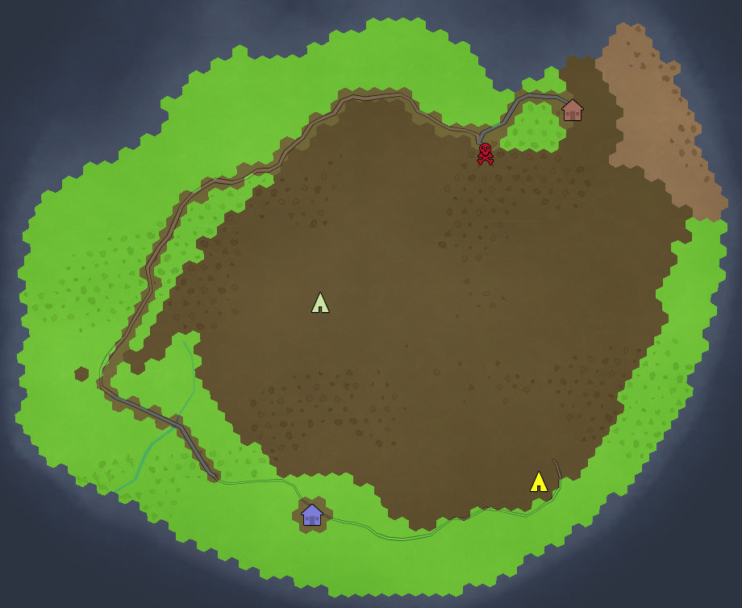

# Filtering

There are four types of filter in `PrepareLanding`:

- [Single choice](#single-choice) filters
- [Three state](#three-state) filters
- [Orderable three state](#orderable-three-state) filters
- [Usable numeric](#usable-numeric) filters

## Single Choice

The single choice selection is the simplest one: you only have a single choice to select your filter.

For example, the biome selection is one of them as you can only choose one biome at a time.

## Three states

Three state items have, as their name implies, three possible states:

- On: 
- Off: 
- Partial: 

The `On` state means:
    - I absolutely *want* this option when filtering tiles
    
The `Off` state means:
    - I absolutely *do not want* this option when filtering tiles    
    
The `Partial` state means:
    - I do not care if this option is available or not when filtering tiles
    
    
### Three states: simple example

Let's take an example with the [Coastal Tile](terrain.md#coastal-tiles) filter on the [Terrain Tab](terrain.md). (`World Map -> Version: A17b; Seed: flo; World coverage: 5%`)

Below is an overview of the world map where:

- the Boreal Forest biome is filtered (all Boreal Forest biome tiles are highlighted)
- The coastal tile state is `On`, which means: **coastal tiles must be included**

In this state (as we are in the `On` state) all coastal tiles match. Note that this is the same behavior for the `Partial` state (which would mean: I don't care if it's coastal or not).

Now here is an overview of the world map where:

- The Boreal Forest biome is filtered (all Boreal Forest biome tiles are highlighted)
- The coastal tile state is `Off`: **coastal tiles must not be included**

Notice how in this state, coastal tiles were removed from the filtering.

### Three states: advanced example

Here is an example of the [Road Types](terrain.md#road-types) filter on the [Terrain Tab](terrain.md). (`World Map -> Version: A17b; Seed: poker; World coverage: 5%`)

We start with a default filter for road types:

Below is an overview of the world map where:

- The Boreal Temperate Forest biome is filtered (all Temperate Forest biome tiles are highlighted)
- The road filter is its default state (all road filters are in their Partial State which means: **Tiles may or may not have a road.** (this implies that all tiles match).

Now with the following road filter applied:

The above filter means:

- Tiles must have a `Stone Road`
- Tiles may or may not have a `Dirt Path`
- I do not want tiles with a `Dirt Road`, `Ancient Asphalt Road`, `Ancient Asphalt`

Notice the higher priority of the `Stone Road` filter: this immediately makes all tiles with a Stone Road a must have, deselecting all tiles **without** a `Stone Road`.

On the other hand, with the following filter:

- Tiles may or may not have a `Dirt Path`
- I do not want tiles with a `Dirt Road`, `Stone Road`, `Ancient Asphalt Road`, `Ancient Asphalt`

Notice how all tiles with or without a `Dirt Path` are selected, but the tiles with the other road types are deselected:

## Orderable Three State

`TODO`

## Usable Numeric

`TODO`