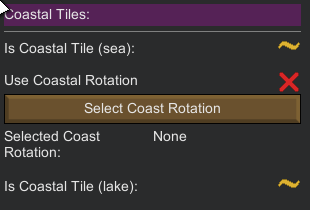
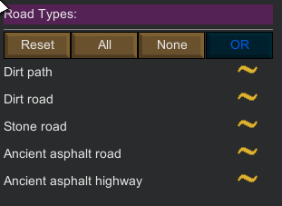
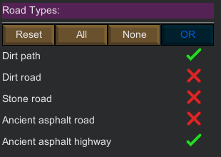

Filtering
=========

*** Warning: This page is in construction ***

Filtering is done by selecting the filters available in the [terrain](terrain.md) and [temperature](temperature.md) tab.

Once you have selected one or more filter, you can click the `Filter` button at the bottom of the main `PrepareLanding` window. The filtered tiles (according to the set of applied filters) are then highlighted on the world map.

There are four categories of filters in `PrepareLanding`:
- [Single choice](#single-choice) filters
- [Three state](#three-states) filters
- [Orderable three state](#orderable-three-state) filters
- [Usable numeric](#usable-numeric) filters

# Single Choice

The single choice selection is the simplest one: you only have a single choice to select your filter.

For example, the biome selection is one of them as you can only choose one biome at a time.

# Three States

Three state items have, as their name implies, three possible states:
- On: 
- Off: 
- Partial: 

The `On` state means:
- I absolutely **want** this option when filtering tiles
  
The `Off` state means:
- I absolutely **do not want** this option when filtering tiles
  
The `Partial` state means:
- I **do not care** if this option is available or not when filtering tiles.
  
Note that when clicking on a state item, the order of appearance is: `Partial` -> `Off` -> `On` -> `Partial` -> etc.

# Three States Boolean

Three States Boolean filtering is like the default Three States (standard) filtering except a strict Ternary Boolean filtering takes place.

As of now, only `Roads` and `Rivers` filters support this option.

- `On` state: Boolean `True`
- `Off` state: Boolean `False` (same as a Boolean `NOT`)
- `Partial` state (depends on the type of filter)
    - `OR`: logically same as `On`
    - `AND`: add a supplementary Boolean `OR` check.

## Understanding Three States Boolean Filtering

There are two possible Boolean filters:

- `OR`: each of the items are evaluated separately, in conjugation with their state.
- `AND`: all of the items are evaluated together, in conjugation with their state.

### OR Filtering

The `OR` filtering applies a Boolean `OR` operator for each items in the list, where each item describes what should or shouldn't be in the tile.

Think of it as each item being evaluated separately. If any (one or more) of the checks results in a boolean `True` condition, then the tile is included.

*Tip*: Only **one** `True` condition is enough for the tile to be included.

### AND Filtering

The `AND` filtering applies a Boolean `AND` operator for all items in the list, where each item describes what should or shouldn't be in the tile.

Think of it as if all items were evaluated together. If any (one or more) of the checks results in a boolean `False` condition, then the tile is not included.

*Tip*: Put in another way, **all conditions** must be `True` for the tile to be included in the matching list.

### Side Effects

The side effect of a strict boolean filtering is that `False` conditions **never** select anything as the result is discarded.

So if you have to remember one one crucial thing when using these filters: `Off` never selects anything!

As an example of this side effect, if you sets all of the roads to `Off` (meaning you don't want any road in the tile) this won't select tiles without any roads...

As this might be counter-intuitive a special condition has been implemented so users don't feel the filters are not working correctly: 
If all items are in a `Off` then they still select tiles (in the previous example, this would still select tiles without any road).

TODO: explain OffPartialNoSelect button

## Orderable Three States

The orderable three state filter works like the [three state filter](#three-states) except the order itself can be changed.

Here is a live example:

Note that the reordering is only meaningful for the `On` and `Partial` states (the `Off` state, by definition, has no precise order).

The above example means:
- Filter tiles that have `Sandstone` in first position
- Filter tiles that have `Limestone` in second position
- Filter tiles that may or may not have `Slate` in third position
- Do not include tiles that have `granite`
- Do not include tiles that have `marble`

As of now, only the `Stone type` filter is re-orderable.

## Usable Numeric

A `usable numeric` filter is comprised of three items:
- A on / off button for the filter usage
    - if `on` the filter is taken into account
    - if `off` the filter is not included
- Two numeric fields (int or float) with a min and max value.

Note: integer fields don't let you enter the decimal point while float fields allow you to do so.

Do not forget to click on the `Use` button if you want to use the filter!

# Live Filtering

Instead of having to click on the `Filter` button, you also have the possibility to use `Live Filtering` by choosing this option in the `Options` tab of the main window.
Be wary that this option may result in CPU heavy combination of filters in some cases, which might result in the game freezing for some time.

# Three States Filtering Examples

## Three states: simple example

Lets take an example with the [Coastal Tile](terrain_tab.md#coastal-tiles) filter on the [Terrain Tab](terrain.md). (`World Map (RimWorld Version: B18); Seed: flo; World coverage: 5%`)

1. Set a [biome filter](terrain_tab.md#biome-type) for `Boreal Forest`.
2. Let the [coastal filter](terrain_tab.md#coastal-tiles) in its default `Partial` state .

Now press the `Filter` button at the bottom of the `PrepareLanding` window.

### Partial State

Below is a picture of the highlighted tiles:

As you can see all tiles of the boreal forest biome are highlighted, as the coastal filter is in the `Partial` state. In this state it means: we don't care if tiles are coastal or not.

Put in another way, when a filter is in partial state, it simply means that it both match `On` and `Off`.

### Off State

Now go to the coastal filter and make sure it is in the `Off` state (red checkmark: ). In this state it means: **coastal tiles must not be included**.

Notice how in this state, coastal tiles were removed from the filtering.

### On State

Now go to the coastal filter and make sure it is in the `On` state (green checkmark: ) where it means: **only coastal tiles must be included**.

The coastal tile state is `On`, which means: in this state (as we are in the `On` state) only coastal tiles match.

Notice how only tiles that are coastal tiles are highlighted!

## Three States: advanced example

Roads and Rivers are a combination of multiple three states items (`On`, `Off` and `Partial`) and Boolean filtering.

Here is an example of the [Road Types](terrain.md#road-types) filter on the [Terrain Tab](terrain.md). (`World Map (Rimworld Version: B18); Seed: goldfish; World coverage: 100%`)

We start with a default filter for road types (all items to `Partial` state and `OR` Boolean filtering):

Below is an overview of the world map where:
- The Boreal Temperate Forest biome is filtered (all Temperate Forest biome tiles are highlighted)
- The road filter is its default state (all road filters are in their Partial State which means: **Tiles may or may not have a road** (this implies that all tiles match.)

Now with the following road filter applied:

The above filter means:
- Tiles must have a `Stone Road`
- Tiles may or may not have a `Dirt Path`
- I do not want tiles with a `Dirt Road`, `Ancient Asphalt Road`, `Ancient Asphalt`

Notice the higher priority of the `Stone Road` filter: this immediately makes all tiles with a Stone Road a must have, deselecting all tiles **without** a `Stone Road`.

On the other hand, with the following filter:

- Tiles may or may not have a `Dirt Path`
- I do not want tiles with a `Dirt Road`, `Stone Road`, `Ancient Asphalt Road`, `Ancient Asphalt`

Notice how all tiles with or without a `Dirt Path` are selected, but the tiles with the other road types are deselected:

