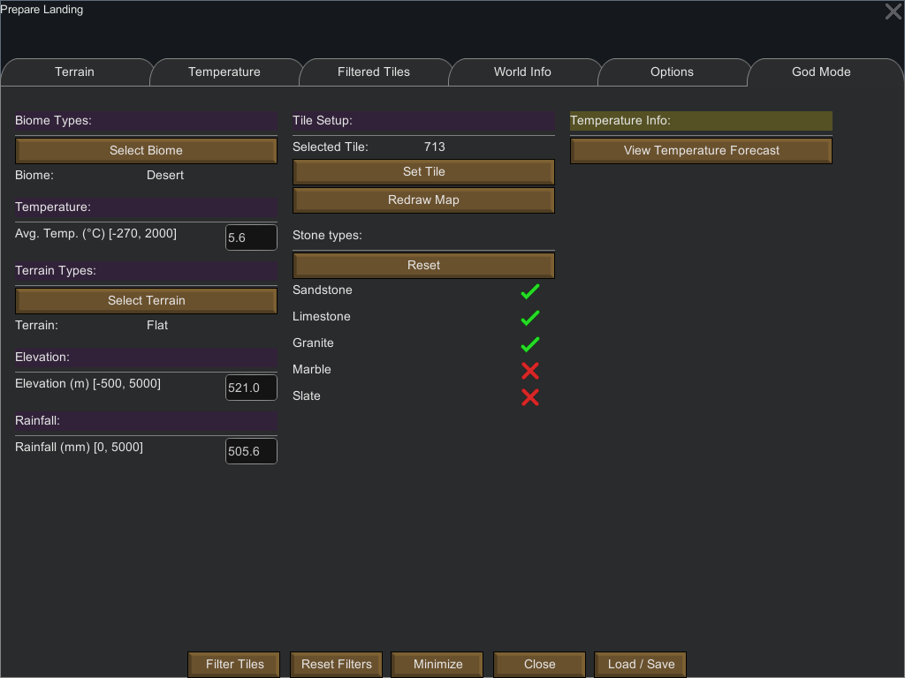

God Mode Tab
============

The god mode tab allows you to **change** various features of a tile.

# Activating the Tab

By default the `god mode` tab is not displayed; to be able to see it you need:

1. To be in Developer Mode
2. To activate God Mode

Activating Dev Mode is done by pressing the `Options` button on the Rimworld start screen:

Once Dev. Mode is activated, you should see the following at the top of the screen. Click on the `View Settings` button (third from the left):

To activate God Mode you simply need to click on `God Mode` option. 

Once this is done, you should see the new `God Mode` tab on the `PrepareLanding` main window.

# Features

As of now, the following features of a tile can be changed:

- Biome
- Average Temperature
- Terrain
- Elevation
- Rainfall
- Stone Types

To change feature simply choose the ones you want to change and finally click on the "Set Tile" Button. If you changed the biome or the elevation, you might want to click the `Redraw Map` button to reflect your change on the world map.

On the left part of the window you can find a button that is equivalent to the [Temperature Forecast](temperature_tab.md#temperature-forecast) of the [Temperature Tab](temperature_tab.md).