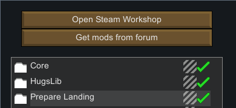

Installing
==========

## Prerequisites

`PrepareLanding` requires the following mod to be installed:

- `HugsLib` by UnlimitedHugs
    - [GitHub](https://github.com/UnlimitedHugs/RimworldHugsLib/releases/latest)
    - [Steam](http://steamcommunity.com/sharedfiles/filedetails/?id=818773962)
	
Remember to put the `HugsLib` mod before `PrepareLanding` once you have clicked the in-game `Mod` button.

`PrepareLanding` also uses [Harmony](https://github.com/pardeike/Harmony) by Pardeike (this mod ships with HugsLib so you don't have to do anything).

## Installation

### From Github

`PrepareLanding` is not different from the other mods for the installation procedure.

1. Download the latest version [here from Github](https://github.com/neitsa/PrepareLanding/releases/latest)
2. Open / extract the downloaded ZIP archive
3. Move the `PrepareLanding` directory in the `\Mods` folder (**not** in `Mods\Core`!)
4. Depending on your operating system the location of the `Mods`Folder can be different:
    * Windows:
        - Move the extracted `PrepareLanding` folder into your `RimWorld***Win/Mods/` folder
    * Mac:
        - Right-click the RimWorld application and show package contents
            - For Steam users the directory is : cd Library/Application\ Support/Steam/steamapps/common/RimWorld
        - Move the extracted `PrepareLanding` folder into your `Mods` folder inside the application package
    * Linux:
        - Extract the archive into the `/Mods` folder inside  `~/.steam/steam/steamapps/common/Rimworld/Mods`
5. Start up your game
6. Click the in-game Mods button
    - Ensure `HugsLib` is placed **before** `PrepareLanding` (not necessarily *right* before though)
    - Activate both `HugsLib` and `PrepareLanding` mods.
	

### From Steam

The `PrepareLanding` mod is also available on [Steam](http://steamcommunity.com/sharedfiles/filedetails/?id=1095331978). You just have to click on the subscribe button. If you wish to do so, you can also leave a comment and / or a rating.

As in the [From Github](#from-github) explanation above, remember to put `HugsLib` **before** the `PrepareLanding` mod.