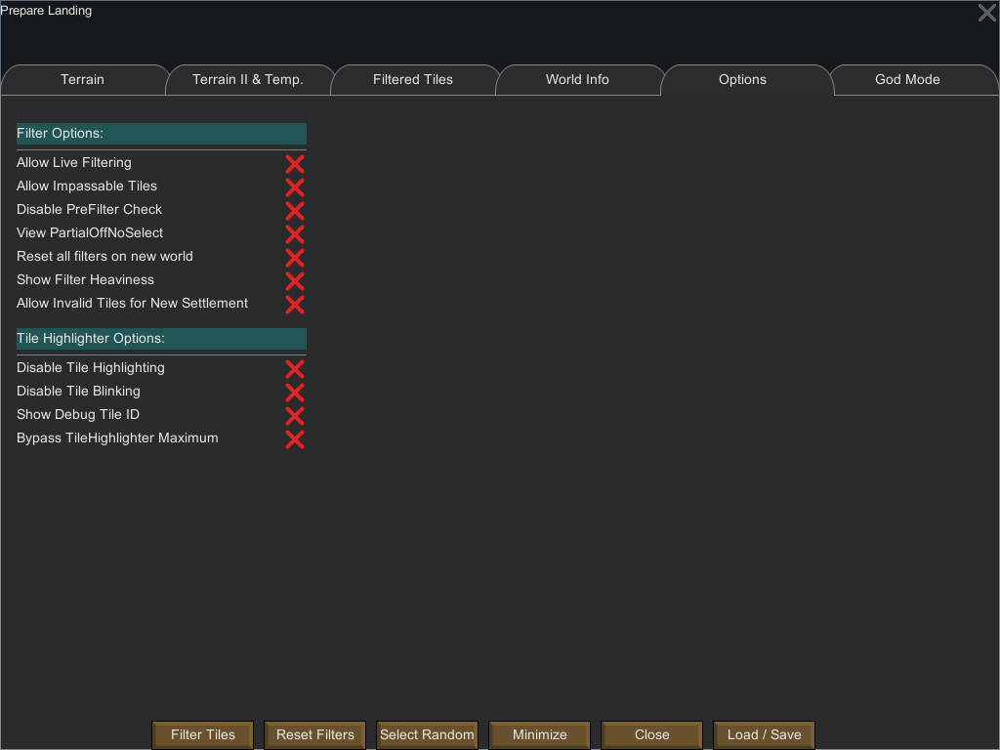

Options Tab
===========

The options tab deals with various game options

There are two main sets of options: filters options and Tile Highlighter options.

# Filter Options

Filter options are options that have a direct impact on the filtering process.

* Allow Live Filtering: Allow to do filtering without pressing the `Filter Tiles` button. It is not recommended to use this option as it is CPU heavy and can lead to game freezes. It is nonetheless usable with light filter.
* Allow Impassable Tiles: Allow selection and filtering of impassable tiles
* Disable PreFilter Check: Disable the check that forces the selection of a biome and a terrain if the world coverage is greater or equal to 50%.
* Reset All filters on new world: By default, filters are kept between world (if you filter tiles on a world and then generate a new world, you still have the same filter applied). This option disable this default behavior.
* Show Filter Heaviness: If On, this colorize the header of each filters on the GUI
    - Green: Ligth filter
    - Yellow: Somewhat 'heavy' filter (take some CPU time)
    - Red: Heavy filter (heavy on CPU calculation)
* Allow Invalid tiles for new settlement: By default the tiles that are invalid for a new settlement are **not** selected in the filtering result. This option disables this behavior.
* Go To Tile: Allows you to go to a tile given its ID.

# Tile Highlighter Options

* Disable Tile Highlighting: Completely disable the highlighting of filtered tiles on the world map.
* Disable Tile Blinking: Disable the filtered tile blinking (filtered tiles keep a constant illumination)
* Show debug Tile ID: if you zoom on the map, you'll see that each tile has an 'X' on it (indicating the tile center). By enabling this option you can see the Tile ID rather than the 'X'.
* Bypass TileHighlighter Maximum: By default the mod will not allow more than 10000 tiles to be highlighted. This option disable this check.

