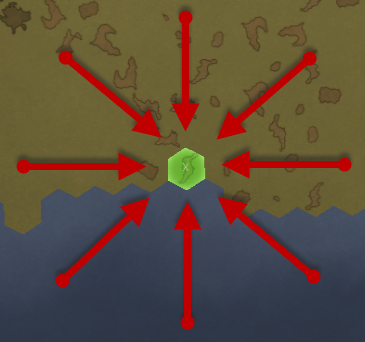
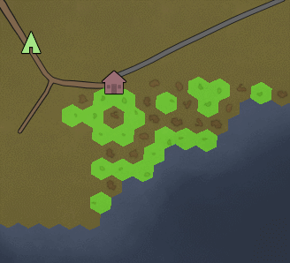

PrepareLanding
==============

**PrepareLanding** is a mod for the [RimWorld](https://rimworldgame.com/) game by [Ludeon studios](https://ludeon.com/blog/). It allows players to carefully choose their landing site before actually starting their colony.

Choosing a landing site can be done by applying and using different set of filters, resulting in a unique combination of tiles, which are then highlighted on the world map.

It is also possible to **change** the current characteristics of a tile for the following features (see [God Mode Tab](god_mode_tab.md)):
* Biome
* Temperature
* Terrain
* Elevation
* Rainfall
* Stone Types

Manual
------

* [Installing](installing.md)
* [Starting](starting.md)
* [The Main Window](starting.md#main-window)
    * [Terrain Tab](terrain_tab.md)
    * [Temperature Tab](temperature_tab.md)
    * [Filtered Tiles Tab](filtered_tiles_tab.md)
    * [World Info Tab](world_info_tab.md)
    * [Options Tab](options_tab.md)
    * [God Mode Tab](god_mode_tab.md)
    * [Minimized Window](starting.md#minimized-window)
* [Filtering](filtering.md)