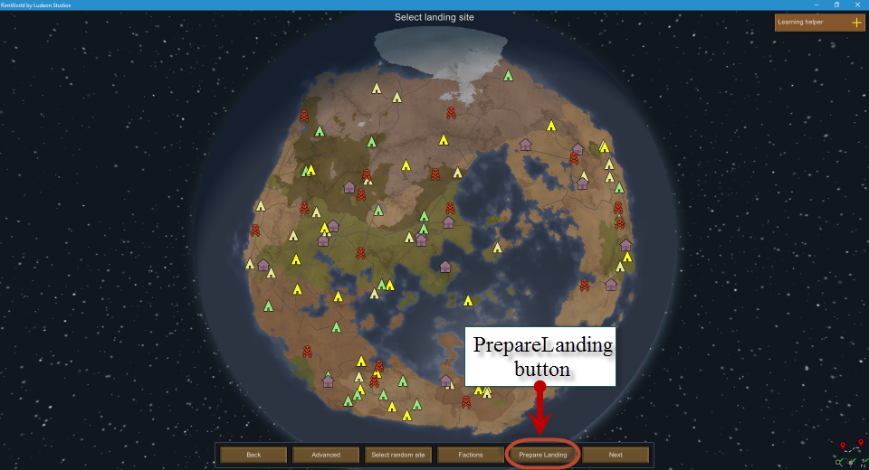
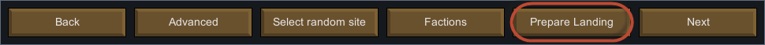
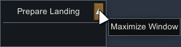
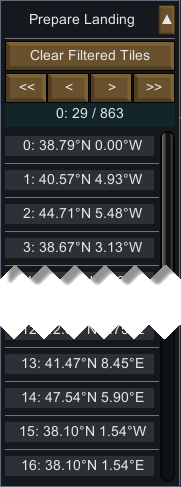

Starting
========

- [Overview](#overview)
- [Main Window](#main-window)
- [Minimized Window](#minimized-window)

Overview
--------

`PrepareLanding` allows you to choose tiles on the world map by applying and combining different set of filters.

Available filters are:

* Terrain
    - Biome Type
    - Terrain Type
    - Road Type
    - River Type
    - Movement Time
        - Current Movement Time
        - Summer Movement Time
        - Winter Movement Time
    - Stone Types
    - Coastal Tiles
    - Elevation
    - Time Zone
	
* Temperature
    - Temperature
        - Average Temperature
        - Winter Temperature
        - Summer Temperature
    - Growing Period
    - Rainfall
    - Animals Can Graze Now
	
* Most / Least Features
	- Elevation
	- Temperature
	- Rainfall
 
It also offers the possibility of changing various features of an existing tiles (in `God mode` as explained in [God Mode Tab](god_mode_tab.md)).

`PrepareLanding` is available during two moments in RimWorld:
* Before you have started your colony, during the `Select landing site` page.
* Once in game (your colony has already settled), by clicking the `World` button on the bottom button bar.

By combining a different set of filters you can finally chose a different set of tiles where to settle.

For example, you might want to filters:
- Biomes (e.g. only tiles that are a Temperate Forest)
- Roads (e.g. only tiles that have a dirt road but **not** an ancient asphalt highway)
- River (e.g. only tiles that have every type of rivers except a Huge River)
- Coastal (only tiles that are coastal tiles)
- With a Year-Round growing period (only tiles that allow growing plants during the whole year).

The `PrepareLanding` mod will then apply all these filters and highlight (and also build a list) of all the tiles that match your filters.

At the end you are the master of your fate and ultimately decide in which tile you want to settle (and start your human hat crafting colonies).

Main Window
-----------

Once you have chosen your world on the "Create World page" at the beginning of a new game (Seed, Planet Coverage, etc.) the "Select Landing Site" page appears:

As you can see in the above screenshot, once `PrepareLanding` is installed, a new button appears in the bottom button bar, simply labeled "Prepare Landing."

Clicking on this button display a new window with five tabs (note that the `God Mode` tab is hidden by default):

* [Terrain](terrain_tab.md)
* [Temperature](temperature_tab.md)
* [Filtered Tiles](filtered_tiles_tab.md)
* [World Info](world_info_tab.md)
* [Options](options_tab.md)
* [God Mode](god_mode_tab.md)

The above links discuss in detail each of the tabs and their content.

The first two tabs contains a set of filters to be applied to the world tiles, while the other contains various information about the filtered tiles (once a set of filters have been applied), the world itself or options for `PrepareLanding`.

The main window itself (besides the tabs) has 4 buttons at the bottom:
* `Filter Tiles`: apply all the filters chosen in the Terrain and Temperature tabs
* `Reset Filters`: reset all filters to their default state
* `Minimize`: [minimize](#minimized-window) the main window. Helpful once you have applied some filters and the main window is in your way.
* `Close`: Close the main window. You can still make it reappear by clicking the `PrepareLanding` button at the bottom.
* `Load / Save`: Load or save filters and / or options.

Minimized Window
----------------

The main window can enter the minimized state by clicking the `Minimize` button at the bottom.

By default, the minimized window is empty, with just a `Maximize` button:

If a set of filters have been applied, the minimized window also displays a set of the matching tiles with their coordinates:

You can click on each of the item in the list to see where the tile is located on the world map.

Note: in the above example, the label with `0: 29 / 863` below the buttons means:
- The total list of matching tiles has 863 entries
- You are seeing entries 0 to 29 (30 entries).

The number of viewable matching tiles in the minimized window is limited to 30 entries.