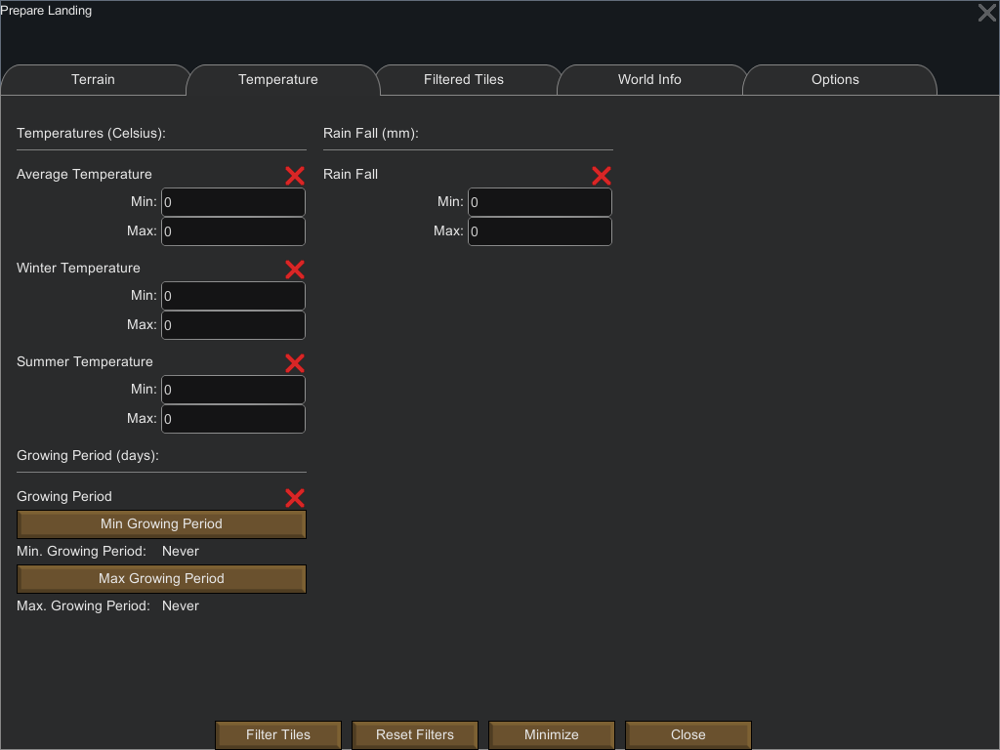
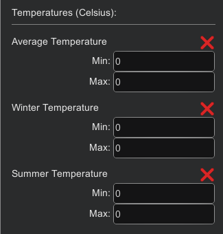
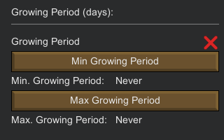
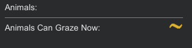
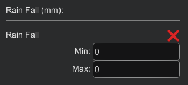
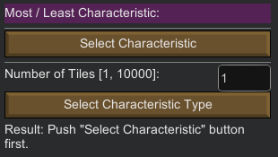
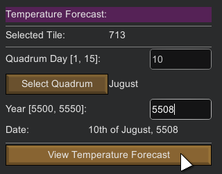
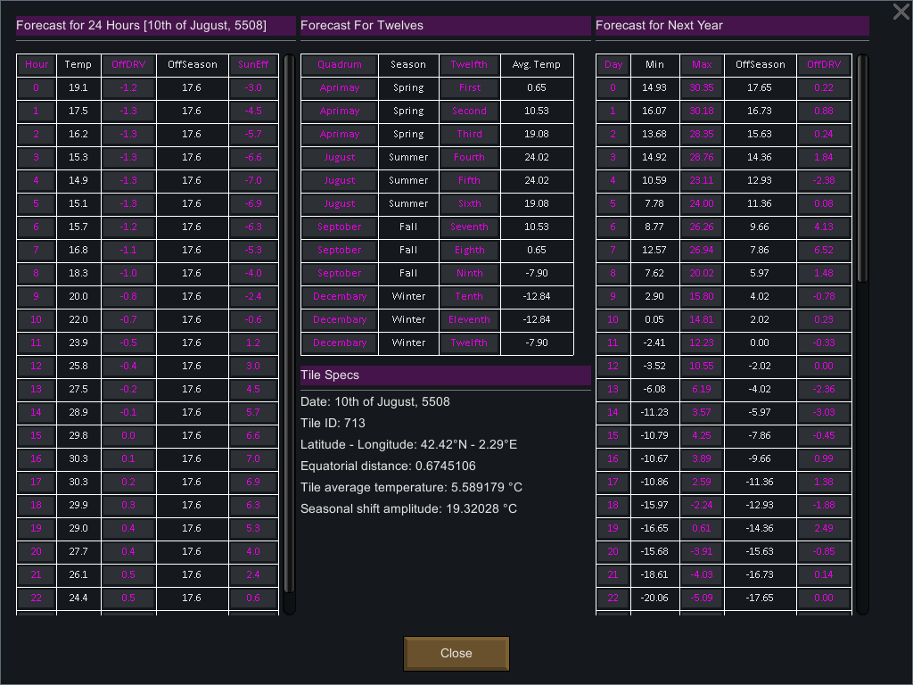

Temperature
============

The temperature tab deals mostly with temperature-related filters.

The list of available filters in this tab is as follows:
* [Temperatures](#temperatures)
    * Average Temperature
    * Winter Temperature
    * Summer Temperature
* [Growing Period](#growing-period)
* [Rainfall](#rainfall)
* [Most / Least Feature](#most-least-feature)
    * Elevation
    * Temperature
    * Rainfall
* [Animals Can graze Now](#animals-can-graze-now)

The "[Temperature Forecast](#temperature-forecast)" is **not** a filter: it allows you to see the temperature forecasts for a given date at a given tile.

# Temperatures

Allows to filter tiles by their temperatures (in °C). These filters are of [Usable Numeric filter](filtering.md#usable-numeric) type.

The Average temperature can be used to filter tiles by their average temperature (the average temperature of the tile during the whole year).
The other two filters are convenience filters for the summer and winter seasons temperatures.
  
Technically, the game allows temperatures in the range [-270, 1000] °C.

Do not forget to click on the `Use filter` (by default a red cross) if you want the filter to be taken into account.

# Growing Period

Allows to filter tiles by the length of their growing period (in days).

 

To use this filter you must first enable it by clicking on the red cross (which then changes to a green check mark) and then use the two buttons.

The first button indicates the minimum growing period to filter and the second button gives the maximum growing period (both are inclusive). 

If you want to search for a single growing period, set the minimum and maximum to the same value.

Obviously, the minimum growing period cannot be greater than the maximum.

Note that:

1. The game has a 60 days-long year, so the minimum is `Never` (0 day; no growing period) and the maximum is `Year-round` (60 days).
2. Growing periods are organized in period of 5 days; 5 days = a single Twelfth (as there are 12 twelves in a year, which amounts to a total of 60 days).

# Animals Can Graze Now

**Important Note**: this filter is only available while playing (colonies already settled) and not on the world map while selecting the landing site. This is a vanilla game limitation.

 
  
This filter allows to filter tiles by checking if animals are able to graze at the time of the check.
See [three states filtering](filtering.md#three-states) on how to proceed with this type of filter.

# Rainfall

Allows to filter tiles by the quantity of rain / precipitation (in millimeters). Note: Rainfall is useful for farming.

 

This filters is of [Usable Numeric filter](filtering.md#usable-numeric) type.

# Most Least Feature

This filter allows you to filter different tile features by their most or least prevalence.

The currently selectable features are:
* Elevation
* Rainfall
* Temperature

Simply put it allows you to select a given number of tiles with the lowest or highest feature. For example, you might want to choose the 25 tiles with the highest elevation, or filtering the 100 tiles that have the lowest temperature.

Of course you can combine this filter with other filters.

First you need to select the given feature (elevation, temperature or rainfall) and next the type of the feature (most / least or if you wish highest / lowest).
To disable the filter, simply choose "None" as the feature to filter. This disable the filter altogether.

# Temperature Forecast

The temperature forecast allows you to see the temperature forecast for a given tile.

To use this feature:

1. Select a tile on the world map
2. Select a date on the date selector
3. Push the "View Temperature Forecast" button

The date selector allows you to choose the date for which the forecast should be done, it has three main components:

* Day of the Quadrum [1, 15]
* Quadrum [Aprimay, Jugust, Setptober, Decembary]
* Year [5500, 5550]

Once you have pushed the "View Temperature Forecast", the following window appears:

* The lefmost table indicates the average outdoor temperatures for each hour of the selected day.
* The middle table indicates the average outdoor temperature for each twelves of the selected year.
* The rightmost table gives the minimum & maximum temperatures for the next year, sarting at the selected date (note: a year in RimWorld is 60 days; day 0 being the currently selected day).

The "Tile Specs" gives you various information about the selected day, the selected tile and temperatures.

