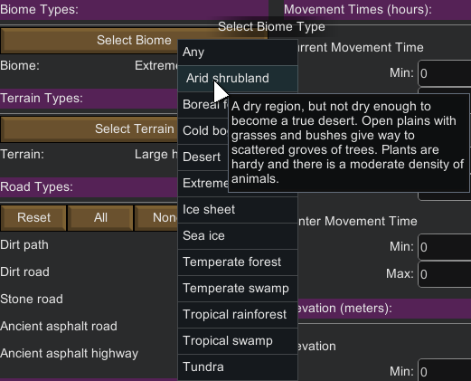

Terrain Tab
===========

The terrain tab deals with terrain-related filters.

The list of available filters in this tab are:

- [Biome Type](#biome-type)
- [Terrain Type](#terrain-type)
- Road Type
- River Type
- Movement Time
    - Current Movement Time
    - Summer Movement Time
    - Winter Movement Time
- Stone Types
- Coastal Tiles
- Elevation
- Time Zone

Biome Type
----------

Choose one of the available biomes, even custom ones from other mods, by clicking the `Select Biome Type` button.

Once a biome is chosen, only tiles from that biomes will be selected.

The vanilla game offers 8 biomes where you can settle (please note that biomes that don't allow bases can't be filtered):

- Arid Shrubland
- Boreal Forest
- Desert
- Extreme Desert
- Ice Sheet
- Sea Ice
- Temperate Forest
- Tropical Rainforest
- Tundra

Please note that the 'Any' biome simply means "All available biomes". This is the default filter state, which also means that no biome filtering is applied in this state.

Terrain Type
------------

Choose one of the available terrain type (even custom ones from other mods), by clicking the `Select Terrain` button.

