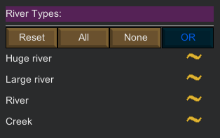

Terrain Tab
===========

The terrain tab deals with terrain-related filters.

The list of available filters in this tab is:

- [Biome Type](#biome-type)
- [Terrain Type](#terrain-type)
- [Road Type](#road-type)
- [River Type](#river-type)
- [Movement Times](#movement_times)
    - Current Movement Time
    - Summer Movement Time
    - Winter Movement Time
- Stone Types
- [Coastal Tiles](#coastal-tiles)
- Elevation
- Time Zone

Biome Type
----------

Choose one of the available biomes, even custom ones from other mods, by clicking the `Select Biome Type` button.

Once a biome is chosen, only tiles from that biome will be selected.

The vanilla game offers 8 biomes where you can settle (please note that biomes that don't allow bases can't be filtered):

- Arid Shrubland
- Boreal Forest
- Desert
- Extreme Desert
- Ice Sheet
- Sea Ice
- Temperate Forest
- Tropical Rainforest
- Tundra

Please note that the `Any` biome simply means “All available biomes.”

This is the default filter state, which also means that no specific biome filtering is applied in this state (or put in a different way: all biome tiles match)

Terrain Type
------------

Choose one of the available terrain types (even custom ones from other mods), by clicking the `Select Terrain` button.

Once a terrain is chosen, only tiles with that terrain will be selected.

The vanilla game offers five terrain types:

- Flat
- Small hills
- Large hills
- Mountainous
- Impassable

Notice that the impassable terrain can't be chosen in `PrepareLanding` as it is not possible to settle your colony in such a terrain.

However the `[TODO]` “Allow impassable tiles” in the Options tab allow you to choose and filter tiles with an impassable terrain.

Road Type
---------

Choose a combination of the available road types by clicking one or more of the three-state options.

The vanilla game offers 5 road types (from the smallest to the biggest):

- Dirt path
- Dirt Road
- Stone Road
- Ancient asphalt road
- Ancient asphalt highway

See [three-state filtering](filtering.md#three-states) on how to proceed with this type of filter.

The `Reset All` button reset all the road filters to their default state (Partial state).

River Type
----------

Choose a combination of the available river types by clicking one or more of the three-state options.

The vanilla game offers four river types (from the biggest to smallest):

- Huge river
- Large river
- River
- Creek

See [three-state filtering](filtering.md#three-states) on how to proceed with this type of filter.

The `Reset All` button reset all the road filters to their default state (Partial state).

Movement Times
--------------

Movement times filter allows you to filter tiles by the average time it would take to traverse the whole tile (for a pawn with default movement speed), depending on the season.

- Current movement time: the time it would take to traverse the tile during the current season.
- Winter movement time: the time it would take to traverse the tile during the winter season.
- Summer movement time: the time it would take to traverse the tile during the summer season.

Do not forget to click on the `Use filter` if you want the filter to be taken into account.

Stones Types
------------

Choose a combination of the available stones types by clicking one or more of the three-state options.

The vanilla game offers five stone types:

- Granit
- Limestone
- Marble
- Sandstone
- Slate

See [three-state filtering](filtering.md#orderable-three-states) on how to proceed with this type of filter.

The `Reset All` button reset all the road filters to their default state (Partial state).

Coastal Tiles
-------------

