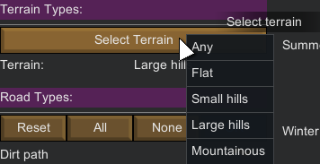
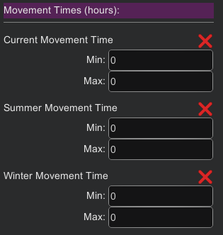
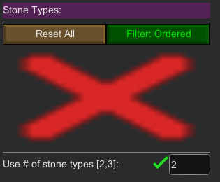
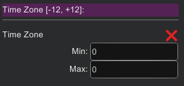

Terrain Tab
===========
The terrain tab deals with terrain-related filters.

The list of available filters in this tab is:

- [Biome Type](#biome-type)
- [Terrain Type](#terrain-type)
- [Road Type](#road-type)
- [River Type](#river-type)
- [Movement Times](#movement-times)
    - Current Movement Time
    - Summer Movement Time
    - Winter Movement Time
- [Stone Type](#stone-type)
 - [Number of Stones](#number-of-stones)
- [Coastal Tiles](#coastal-tiles)
- [Elevation](#elevation)
- [Time Zone](#time-zone)

Biome Type
----------

Choose one of the available biomes, even custom ones from other mods, by clicking the `Select Biome Type` button.

Once a biome is chosen, only tiles from that biome will be selected.

The vanilla game offers height biomes where you can settle (please note that biomes that don't allow bases can't be filtered):
- Arid Shrubland
- Boreal Forest
- Desert
- Extreme Desert
- Ice Sheet
- Sea Ice
- Temperate Forest
- Tropical Rainforest
- Tundra

Please note that the `Any` biome simply means "All available biomes."

This is the default filter state, which also means that no specific biome filtering is applied in this state (or put in a different way: all biome tiles match)

Terrain Type
------------

Choose one of the available terrain types (even custom ones from other mods), by clicking the `Select Terrain` button.

Once a terrain is chosen, only tiles with that terrain will be selected.

The vanilla game offers five terrain types:
- Flat
- Small hills
- Large hills
- Mountainous
- Impassable

Notice that the impassable terrain can't be chosen in `PrepareLanding` as it is not possible to settle your colony in such a terrain.
However the "Allow impassable tiles" in the Options tab allow you to choose and filter tiles with an impassable terrain.

Road Type
---------

Choose a combination of the available road types by clicking one or more of the three-state options.

The vanilla game offers five road types (from the smallest to the biggest):
- Dirt path
- Dirt Road
- Stone Road
- Ancient asphalt road
- Ancient asphalt highway

See [three states filtering](filtering.md#three-states) on how to proceed with this type of filter.

The `Reset` button reset all the road filters to their default state (Partial state). The `All` button select all roads (On state) while the `None` button de-select all of them (Off state).

River Type
----------

Choose a combination of the available river types by clicking one or more of the three-state options.

The vanilla game offers four river types (from the biggest to smallest):
- Huge River
- Large River
- River
- Creek

See [three states filtering](filtering.md#three-states) on how to proceed with this type of filter.

The `Reset All` button reset all the river filters to their default state (Partial state). The `All` button select all rivers (On state) while the `None` button de-select all of them (Off state).

Movement Times
--------------

Movement times filter allows you to filter tiles by the average time it would take to traverse the whole tile (for a pawn with default movement speed), depending on the season.

- Current movement time: the time it would take to traverse the tile during the current season.
- Winter movement time: the time it would take to traverse the tile during the winter.
- Summer movement time: the time it would take to traverse the tile during the summer.

Do not forget to click on the `Use filter` if you want the filter to be taken into account.

Stone Type
----------

Choose a combination of the available stones types by clicking one or more of the three-state options.

The vanilla game offers five stone types:
- Granite
- Limestone
- Marble
- Sandstone
- Slate

Stone order is important because the game gives different stones types (by quantity) once in the game map.

You can see the stone order by clicking a tile on the world map and looking at the terrain tab, then searching for the "Stone Type" entry:

Here, the above order means that there will be more `Sandstone` than `Limestone` than `Slate` stones.

See the [orderable three states filtering](filtering.md#orderable-three-states) on how to proceed with this type of filter.

The `Reset All` button reset all the stone filters to their default state (Partial state).

### Number Of Stones

You can also use the `number of stones` filter which basically allows you to filter tiles with either 2 or 3 types of stones in it, whatever these stone types are.

Notice than when this filter is in use, you can't use the other stone types filter:

Coastal Tiles
-------------

The coastal tile filter is a single [three-state filter](filtering.md#orderable-three-states).

- `On`: Filter tiles that are only coastal tiles
- `Off`: Filter tiles that are not coastal tiles
- `Partial`: both coastal and not coastal tiles match (default behavior)

Note: a coastal tile is a tile with at least a pool of water (see or lakes) in an adjacent tile.

Elevation
---------

Allows to filter tiles by their elevation (in meters). This filter is a [Usable Numeric filter](filtering.md#usable-numeric).

Note: technically the vanilla game allows tile elevation to be in the following range: [-500, 5000].

Time Zone
---------

Allows to filter tiles by their time zone on the world map. This filter is a [Usable Numeric filter](filtering.md#usable-numeric).

Note that the time zones are in the range [-12, 12].