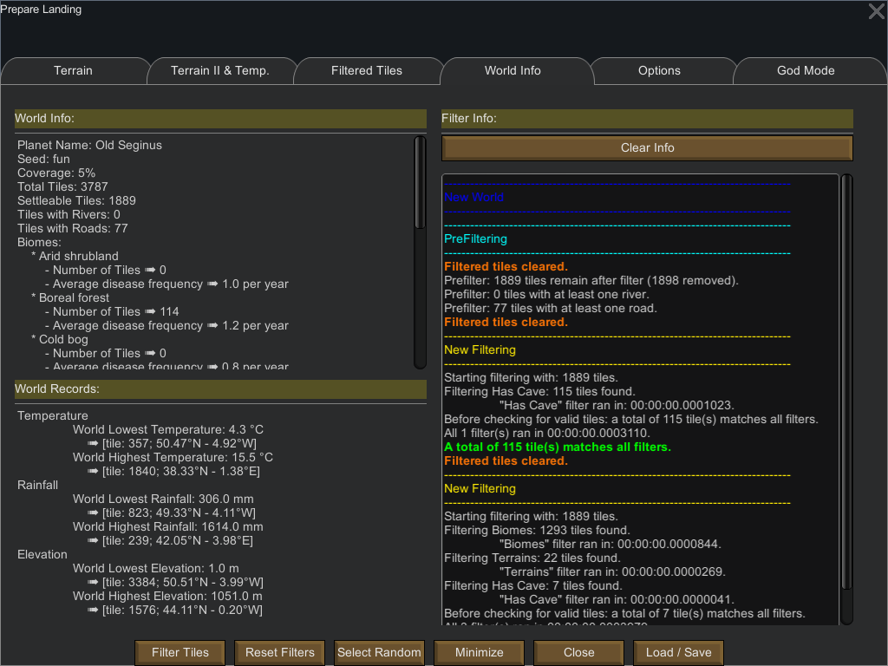

World Info Tab
==============

The world info tab is split in two sub-windows.

* On the left is some information about the world
    - Planet Information
        - Name
        - Seed
        - Coverage
    - Tile Information
        - Total number of tiles
        - Number of colonizable / settleable tiles 
        - Tiles with rivers and roads
        - Number of tiles per biomes
    - Min / max
        - Elevation
        - Temperature
        - Rainfall    

* The right part of the window gives information about the tile filtering process.
    - Filters that were run
    - Time it takes for each filter to process the tiles
    - Number of resulting (filtered) tiles